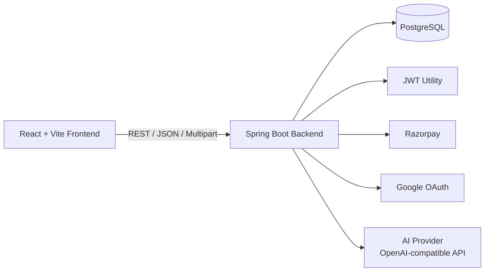
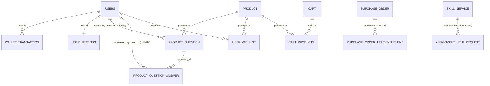

<p align="center">
  
</p>

<h1 align="center">🎓 MyCollegeMart</h1>

<p align="center">
  <strong>Campus Commerce + Services Platform (Full-Stack Monorepo)</strong>
  <br />
  Marketplace, seller workflows, order tracking, assignment help, wallet, AI assistant, and role-based admin tooling.
</p>

<p align="center">
  
  
  
  
  
  
  
</p>

## 📚 Table of Contents

- [Project Overview](#project-overview)
- [Project Highlights](#project-highlights)
- [Role-wise Feature Matrix](#feature-matrix)
- [Architecture](#architecture)
- [Full Monorepo Structure](#full-monorepo-structure)
- [Tech Stack](#tech-stack)
- [Local Setup](#local-setup)
- [Environment Variables](#environment-variables)
- [Auth and Access Model](#auth-and-access-model)
- [Backend API Reference](#backend-api-reference)
- [API Quick Examples](#api-quick-examples)
- [Business Enums and Status Values](#business-enums)
- [Frontend API Client Reference](#frontend-api-client-reference)
- [Database Schema Reference](#database-schema-reference)
- [Relational Mapping](#relational-mapping)
- [Keys and Indexes](#keys-and-indexes)
- [Seed Data](#seed-data)
- [Deployment Notes](#deployment-notes)
- [Build and Validation Commands](#build-and-validation-commands)
- [Quality Gates](#quality-gates)
- [Troubleshooting](#troubleshooting)

<a id="project-overview"></a>
## 📌 Project Overview

MyCollegeMart is a full-stack campus commerce platform with these core domains:

- 🛒 Product marketplace (browse, buy, cart, wishlist)
- 🧾 Checkout and order management (online + COD)
- 🚚 Amazon-style order tracking timeline with admin event controls
- 🏪 Merchant onboarding and seller dashboard
- 💬 Product community Q&A (question/answer flows)
- 🧠 AI chat assistant + feedback analytics
- 📘 Skill marketplace + assignment-help checkout workflow
- 💰 Wallet top-up and wallet-assisted payments
- 👑 Multi-role access model (Individual, Merchant, Admin, Master)

<a id="project-highlights"></a>
## ✨ Project Highlights

| Area | What is implemented | Why this matters |
|---|---|---|
| Commerce Core | Product catalog, cart, wishlist, checkout, orders | Covers complete buy journey end-to-end |
| Amazon-like Tracking | Timeline events, tracking numbers, progress percentage, admin updates | Real operational visibility for buyers and admins |
| Seller Ecosystem | Merchant onboarding, listing management, seller dashboard | Supports campus creators and student businesses |
| Student Services | Skill marketplace and assignment-help checkout flow | Expands platform beyond product commerce |
| AI Layer | AI chat and feedback capture/analytics | Helps users and captures quality insights |
| Wallet + Payments | Razorpay + wallet top-up + hybrid payment handling | Flexible payment experience |
| Responsive UX | Mobile-safe popups, safe-area handling, dynamic page titles | Better usability across real devices |

<a id="feature-matrix"></a>
## 🧭 Role-wise Feature Matrix

| Capability | Public | Individual | Merchant | Admin | Master |
|---|---|---|---|---|---|
| Browse products and media | ✅ | ✅ | ✅ | ✅ | ✅ |
| Ask product question | ❌ | ✅ | ✅ | ✅ | ✅ |
| Add/update/delete answer | ❌ | Limited | ✅ | ✅ | ✅ |
| Cart and wishlist | ❌ | ✅ | ✅ | ✅ | ✅ |
| Place order and track own orders | ❌ | ✅ | ✅ | ✅ | ✅ |
| Create/edit product listing | ❌ | ❌ | ✅ | ✅ | ✅ |
| Seller dashboard | ❌ | ❌ | ✅ | ✅ | ✅ |
| Approve/reject merchants | ❌ | ❌ | ❌ | ✅ | ✅ |
| Add manual order tracking event | ❌ | ❌ | ❌ | ✅ | ✅ |
| View AI feedback moderation panel | ❌ | ❌ | ❌ | ✅ | ✅ |
| Update prime pricing config | ❌ | ❌ | ❌ | ❌ | ✅ |
| Create skill service listing | ❌ | ❌ | ❌ | ❌ | ✅ |

Notes:
- "Limited" answer permission means ownership/authorization checks are applied by backend service rules.
- Effective authorization is enforced in controller/service logic with JWT + role checks.

<a id="architecture"></a>
## 🧱 Architecture



<a id="full-monorepo-structure"></a>
## 🗂️ Full Monorepo Structure

```text
MyCollegeMart/
├── backend/
│   ├── Dockerfile
│   ├── mvnw
│   ├── mvnw.cmd
│   ├── pom.xml
│   ├── README.md
│   └── src/
│       ├── main/
│       │   ├── java/com/mycollegemart/backend/
│       │   │   ├── BackendApplication.java
│       │   │   ├── config/
│       │   │   │   ├── SecurityConfig.java
│       │   │   │   └── WebConfig.java
│       │   │   ├── controller/
│       │   │   │   ├── AdminController.java
│       │   │   │   ├── AiController.java
│       │   │   │   ├── AssignmentHelpController.java
│       │   │   │   ├── AuthController.java
│       │   │   │   ├── CartController.java
│       │   │   │   ├── HelloController.java
│       │   │   │   ├── MediaController.java
│       │   │   │   ├── OrderController.java
│       │   │   │   ├── PrimeMembershipController.java
│       │   │   │   ├── ProductController.java
│       │   │   │   ├── ProductQuestionController.java
│       │   │   │   ├── SellerController.java
│       │   │   │   ├── SettingsController.java
│       │   │   │   ├── SkillServiceController.java
│       │   │   │   ├── WalletController.java
│       │   │   │   └── WishlistController.java
│       │   │   ├── model/
│       │   │   │   ├── AiFeedback.java
│       │   │   │   ├── AssignmentHelpRequest.java
│       │   │   │   ├── Cart.java
│       │   │   │   ├── MediaAsset.java
│       │   │   │   ├── PrimeMembershipConfig.java
│       │   │   │   ├── Product.java
│       │   │   │   ├── ProductQuestion.java
│       │   │   │   ├── ProductQuestionAnswer.java
│       │   │   │   ├── PurchaseOrder.java
│       │   │   │   ├── PurchaseOrderTrackingEvent.java
│       │   │   │   ├── SkillServiceListing.java
│       │   │   │   ├── User.java
│       │   │   │   ├── UserSettings.java
│       │   │   │   └── WalletTransaction.java
│       │   │   ├── repository/
│       │   │   │   ├── AiFeedbackRepository.java
│       │   │   │   ├── AssignmentHelpRequestRepository.java
│       │   │   │   ├── CartRepository.java
│       │   │   │   ├── MediaAssetRepository.java
│       │   │   │   ├── OrderRepository.java
│       │   │   │   ├── OrderTrackingEventRepository.java
│       │   │   │   ├── PrimeMembershipConfigRepository.java
│       │   │   │   ├── ProductQuestionAnswerRepository.java
│       │   │   │   ├── ProductQuestionRepository.java
│       │   │   │   ├── ProductRepository.java
│       │   │   │   ├── SellerRepository.java
│       │   │   │   ├── SkillServiceRepository.java
│       │   │   │   ├── UserRepository.java
│       │   │   │   ├── UserSettingsRepository.java
│       │   │   │   └── WalletTransactionRepository.java
│       │   │   ├── service/
│       │   │   │   ├── AiAssistantService.java
│       │   │   │   ├── AssignmentHelpService.java
│       │   │   │   ├── CartService.java
│       │   │   │   ├── MediaAssetService.java
│       │   │   │   ├── OrderService.java
│       │   │   │   ├── PrimeMembershipConfigService.java
│       │   │   │   ├── ProductQuestionService.java
│       │   │   │   ├── ProductService.java
│       │   │   │   ├── SellerService.java
│       │   │   │   ├── SkillServiceManager.java
│       │   │   │   ├── UserService.java
│       │   │   │   ├── UserSettingsService.java
│       │   │   │   ├── WalletService.java
│       │   │   │   └── WishlistService.java
│       │   │   └── util/
│       │   │       └── JwtUtil.java
│       │   └── resources/
│       │       ├── application.properties
│       │       └── schema.sql
│       └── test/
│           └── java/com/mycollegemart/backend/...
├── database/
│   └── schema.sql
├── frontend/
│   ├── index.html
│   ├── package.json
│   ├── postcss.config.js
│   ├── tailwind.config.js
│   ├── vite.config.js
│   ├── README.md
│   ├── render.yaml
│   ├── public/
│   └── src/
│       ├── App.js
│       ├── index.css
│       ├── index.js
│       ├── components/
│       │   ├── AppContent.js
│       │   ├── common/
│       │   ├── layout/
│       │   ├── product/
│       │   ├── shopping/
│       │   └── UI/
│       ├── context/
│       │   ├── GlobalStateContext.js
│       │   ├── LanguageContext.js
│       │   └── ThemeContext.js
│       ├── pages/
│       │   ├── Auth/
│       │   ├── Info/
│       │   ├── services/
│       │   ├── User/
│       │   ├── Checkout.js
│       │   ├── Home.jsx
│       │   ├── Marketplace.js
│       │   ├── ProductDetail.js
│       │   ├── SkillMarketplace.jsx
│       │   └── StudyCorner.js
│       └── utils/
│           ├── api.js
│           ├── constants.js
│           ├── debugGoogleAuth.js
│           ├── motion.js
│           └── errorHandling/
└── README.md
```

<a id="tech-stack"></a>
## 🛠️ Tech Stack

### Frontend

| Category | Stack |
|---|---|
| Core | React 18.2.0, React DOM 18.2.0 |
| Build Tool | Vite 7.1.9 with @vitejs/plugin-react 5.0.4 |
| Styling | TailwindCSS 3.4.17, PostCSS, Autoprefixer |
| Motion | Framer Motion 10.12.16 |
| Networking | Axios 1.12.2 |
| Routing Utility | react-router-dom 7.9.1 (with custom page-state navigation in app shell) |

### Backend

| Category | Stack |
|---|---|
| Runtime | Java 21 |
| Framework | Spring Boot 3.5.5 |
| Modules | spring-boot-starter-web, data-jpa, validation, security |
| Auth | JWT via jjwt 0.12.6 |
| OAuth | Google API Client 2.2.0 |
| Payments | Razorpay Java SDK 1.4.4 |
| DB Driver | PostgreSQL |
| Build | Maven Wrapper |

### Database and Integrations

| Layer | Technology |
|---|---|
| Primary DB | PostgreSQL |
| Schema Init | Idempotent SQL via database/schema.sql |
| Payment Gateway | Razorpay |
| AI Provider | OpenAI-compatible endpoint (OpenRouter default base URL) |

<a id="local-setup"></a>
## 🚀 Local Setup

### Prerequisites

- Node.js 18+
- npm 9+
- Java 21+
- PostgreSQL 14+

### 1) Start Backend

Windows PowerShell:

```powershell
Set-Location .\backend
.\mvnw.cmd spring-boot:run
```

macOS/Linux:

```bash
cd backend
./mvnw spring-boot:run
```

Default backend URL: `http://localhost:8080`

### 2) Start Frontend

```powershell
Set-Location .\frontend
npm install
npm run dev
```

Default frontend URL: `http://localhost:3000`

<a id="environment-variables"></a>
## ⚙️ Environment Variables

Source: `backend/src/main/resources/application.properties`

### Backend Runtime and Server

| Variable | Default | Purpose |
|---|---|---|
| SERVER_PORT | 8080 | Backend server port |
| FRONTEND_BASE_URL | http://localhost:3000 | OAuth redirect target and frontend base |
| CORS_ALLOWED_ORIGINS | http://localhost:3000 | Allowed CORS origins (comma-separated) |

### Database and JPA

| Variable | Default | Purpose |
|---|---|---|
| DB_URL | jdbc:postgresql://localhost:5432/mycollegemart | JDBC URL |
| DB_USERNAME | postgres | DB user |
| DB_PASSWORD | 1234 | DB password |
| JPA_DDL_AUTO | update | Hibernate schema strategy |
| JPA_SHOW_SQL | false | SQL logging toggle |
| DB_POOL_MAX_SIZE | 10 | Hikari max pool size |
| DB_POOL_MIN_IDLE | 2 | Hikari min idle |
| DB_CONNECTION_TIMEOUT_MS | 30000 | Hikari connection timeout |

### Authentication and Roles

| Variable | Default | Purpose |
|---|---|---|
| JWT_SECRET | dev-only-secret-key-change-me-1234567890abcd | JWT signing secret |
| JWT_EXPIRATION | 36000000 | JWT expiry (ms) |
| APP_ADMIN_EMAILS | empty | Comma-separated admin email allow-list |
| APP_MASTER_EMAIL | master@mycollegemart.local | Master account email |
| APP_MASTER_PASSWORD | Master@1234 | Master account password |

### Google OAuth

| Variable | Default | Purpose |
|---|---|---|
| MYCOLLEGEMART_GOOGLE_CLIENT_ID | empty | Google OAuth client ID |
| MYCOLLEGEMART_GOOGLE_CLIENT_SECRET | empty | Google OAuth client secret |
| MYCOLLEGEMART_GOOGLE_REDIRECT_URI | empty | Explicit backend callback URL |

### Payments

| Variable | Default | Purpose |
|---|---|---|
| RAZORPAY_KEY_ID | empty | Razorpay key id |
| RAZORPAY_KEY_SECRET | empty | Razorpay key secret |

### Multipart Upload Limits

| Variable | Default | Purpose |
|---|---|---|
| MULTIPART_MAX_FILE_SIZE | 25MB | Max size per file |
| MULTIPART_MAX_REQUEST_SIZE | 100MB | Max multipart request size |

### AI Assistant

| Variable | Default | Purpose |
|---|---|---|
| AI_CHAT_BASE_URL | https://openrouter.ai/api/v1 | OpenAI-compatible API base URL |
| AI_CHAT_API_KEY | empty | API key |
| AI_CHAT_MODEL | empty | Model id |
| AI_CHAT_REFERER | http://localhost:3000 | Referer sent to provider |
| AI_CHAT_APP_NAME | MyCollegeMart | App name sent to provider |
| AI_CHAT_TIMEOUT_MS | 30000 | AI call timeout |

### Frontend

| Variable | Default | Purpose |
|---|---|---|
| VITE_API_URL | http://localhost:8080/api | API base URL |
| REACT_APP_API_URL | fallback supported | API base fallback for compatibility |

<a id="auth-and-access-model"></a>
## 🔐 Auth and Access Model

### Identity and Token

- JWT Bearer token is the primary auth mechanism.
- Google OAuth uses backend routes under `/api/auth/google/*`.
- Frontend stores token in localStorage and injects `Authorization: Bearer <token>` via Axios interceptor.

### Role and Access Rules

| Role / State | Typical Access |
|---|---|
| Public user | Browse products, view media, view Q&A, view prime config, submit assignment request, AI chat/feedback |
| Authenticated Individual | Cart, wishlist, checkout, my orders, settings |
| Verified Merchant | Product listing create/edit, seller dashboard, answer product questions |
| Admin | Merchant approvals, admin order search, manual tracking events, AI feedback moderation view |
| Master | Prime membership config updates, skill service creation |

### Important Security Note

- `SecurityConfig` currently uses `auth.anyRequest().permitAll()`.
- Effective authorization is enforced inside controller/service methods by validating JWT headers and role checks.

<a id="backend-api-reference"></a>
## 🌐 Backend API Reference

Base URL (default): `http://localhost:8080`

Auth legend:

- `Public` = no token required
- `JWT` = valid bearer token required
- `Admin` = authenticated user + admin role check
- `Master` = authenticated user + master role check
- `Merchant/Admin` = verified listing manager or admin

### Health and Runtime

| Method | Endpoint | Auth | Purpose |
|---|---|---|---|
| GET | `/api/hello` | Public | Backend warm-up / health ping |

### Authentication (`/api/auth/*` and alias `/auth/*`)

| Method | Endpoint | Auth | Purpose |
|---|---|---|---|
| POST | `/api/auth/register` | Public | Register account with email/password/accountType |
| POST | `/api/auth/login` | Public | Login and receive JWT |
| GET | `/api/auth/google/start` | Public | Begin Google OAuth (`accountType` query optional) |
| GET | `/api/auth/google/callback` | Public | OAuth callback and frontend redirect with token |
| GET | `/api/auth/user` | JWT | Fetch current user profile |
| POST | `/api/auth/account-type` | JWT | Update account type |
| POST | `/api/auth/merchant-profile` | JWT | Update merchant profile fields |
| POST | `/api/auth/profile-image` | JWT | Upload profile image (multipart `image`) |
| DELETE | `/api/auth/profile-image` | JWT | Remove profile image |

### Products and Listing Media

| Method | Endpoint | Auth | Purpose |
|---|---|---|---|
| GET | `/api/products` | Public | Get all products |
| GET | `/api/products/{id}` | Public | Get product by id |
| POST | `/api/products` | Merchant/Admin | Create product using JSON payload |
| POST | `/api/products/listing` | Merchant/Admin | Create listing with multipart media |
| PUT | `/api/products/{id}/listing` (JSON) | Merchant/Admin | Update listing with JSON payload |
| PUT | `/api/products/{id}/listing` (multipart) | Merchant/Admin | Update listing with media upload |
| GET | `/api/products/{id}/media` | Public | Fetch media metadata for listing |

### Product Q&A

| Method | Endpoint | Auth | Purpose |
|---|---|---|---|
| GET | `/api/products/{productId}/questions` | Public | List product questions and answers |
| POST | `/api/products/{productId}/questions` | JWT | Ask a question |
| POST | `/api/products/{productId}/questions/{questionId}/answers` | JWT | Add answer (owner/admin logic in service) |
| PATCH | `/api/products/{productId}/questions/{questionId}/answers/{answerId}` | JWT | Edit answer (author/owner/admin checks) |
| DELETE | `/api/products/{productId}/questions/{questionId}/answers/{answerId}` | JWT | Delete answer (author/owner/admin checks) |

### Cart

| Method | Endpoint | Auth | Purpose |
|---|---|---|---|
| GET | `/api/cart` | JWT or fallback `userId` query | Get detailed cart |
| GET | `/api/cart/{userId}` | Public | Get detailed cart by user id |
| POST | `/api/cart/add` | JWT or fallback `userId` body | Add item to cart |
| PATCH | `/api/cart/item/{productId}` | JWT or fallback `userId` body | Update cart quantity |
| DELETE | `/api/cart/item/{productId}` | JWT or fallback `userId` query | Remove cart item |
| DELETE | `/api/cart/clear` | JWT or fallback `userId` query | Clear cart |

### Checkout and Orders

| Method | Endpoint | Auth | Purpose |
|---|---|---|---|
| POST | `/api/checkout/create-order` | JWT | Create Razorpay order from cart items |
| POST | `/api/checkout/verify-payment` | JWT | Verify Razorpay signature and finalize order |
| POST | `/api/checkout/place-cod` | JWT | Place Cash-on-Delivery order |
| GET | `/api/orders/my` | JWT | Get current user orders with tracking data |

### Wishlist

| Method | Endpoint | Auth | Purpose |
|---|---|---|---|
| GET | `/api/wishlist` | JWT | Get wishlist product ids |
| POST | `/api/wishlist/{productId}` | JWT | Add product to wishlist |
| DELETE | `/api/wishlist/{productId}` | JWT | Remove product from wishlist |
| POST | `/api/wishlist/sync` | JWT | Sync wishlist from client set |

### Settings

| Method | Endpoint | Auth | Purpose |
|---|---|---|---|
| GET | `/api/settings/me` | JWT | Get user profile + preference snapshot |
| PUT | `/api/settings/me` | JWT | Update user settings/preferences |

### Seller

| Method | Endpoint | Auth | Purpose |
|---|---|---|---|
| GET | `/api/seller/dashboard` | Merchant/Admin | Seller dashboard analytics |

### Admin

| Method | Endpoint | Auth | Purpose |
|---|---|---|---|
| GET | `/api/admin/merchants` | Admin | Filter merchant requests by status |
| POST | `/api/admin/merchants/{merchantId}/approve` | Admin | Approve merchant |
| POST | `/api/admin/merchants/{merchantId}/reject` | Admin | Reject merchant |
| GET | `/api/admin/orders` | Admin | Search or fetch recent orders |
| POST | `/api/admin/orders/{orderId}/tracking-events` | Admin | Push manual tracking event |
| GET | `/api/admin/ai-feedback` | Admin | Query AI feedback with filters |

### Prime Membership

| Method | Endpoint | Auth | Purpose |
|---|---|---|---|
| GET | `/api/prime-membership/config` | Public | Get prime and assignment pricing config |
| PUT | `/api/prime-membership/config` | Master | Update prime and assignment pricing config |

### Skill Services

| Method | Endpoint | Auth | Purpose |
|---|---|---|---|
| GET | `/api/skills` | Public | Get all skill service listings |
| POST | `/api/skills` | Master | Create skill service (multipart) |

### Assignment Help

| Method | Endpoint | Auth | Purpose |
|---|---|---|---|
| POST | `/api/assignment-help/requests` | Public | Submit assignment-help request (multipart) |
| POST | `/api/assignment-help/checkout/create-order` | JWT | Create Razorpay order for request |
| POST | `/api/assignment-help/checkout/verify-payment` | JWT | Verify assignment-help payment |
| GET | `/api/assignment-help/requests` | Public | List assignment-help requests |

### Wallet

| Method | Endpoint | Auth | Purpose |
|---|---|---|---|
| POST | `/api/wallet/topup/create-order` | JWT | Create Razorpay top-up order |
| POST | `/api/wallet/topup/verify-payment` | JWT | Verify top-up payment and credit wallet |
| GET | `/api/wallet/transactions` | JWT | List wallet transactions (`limit` query) |

### AI Assistant

| Method | Endpoint | Auth | Purpose |
|---|---|---|---|
| POST | `/api/ai/chat` | Public | AI assistant chat completion |
| POST | `/api/ai/feedback` | Public | Persist AI response feedback |

### Media

| Method | Endpoint | Auth | Purpose |
|---|---|---|---|
| GET | `/api/media/{mediaId}` | Public | Stream media binary by id |

<a id="api-quick-examples"></a>
## 🧪 API Quick Examples

### 1) Register User

```bash
curl -X POST http://localhost:8080/api/auth/register \
  -H "Content-Type: application/json" \
  -d '{
    "email": "student@example.com",
    "password": "StrongPass123",
    "accountType": "INDIVIDUAL"
  }'
```

### 2) Login and Receive JWT

```bash
curl -X POST http://localhost:8080/api/auth/login \
  -H "Content-Type: application/json" \
  -d '{
    "email": "student@example.com",
    "password": "StrongPass123",
    "accountType": "INDIVIDUAL"
  }'
```

### 3) Create Checkout Order

```bash
curl -X POST http://localhost:8080/api/checkout/create-order \
  -H "Authorization: Bearer <JWT_TOKEN>" \
  -H "Content-Type: application/json" \
  -d '{
    "items": [
      { "id": "1", "quantity": 1 },
      { "id": "prime-membership", "quantity": 1 }
    ],
    "deliveryOption": "Express Delivery",
    "walletAmount": 120
  }'
```

### 4) Admin Tracking Event Update

```bash
curl -X POST http://localhost:8080/api/admin/orders/101/tracking-events \
  -H "Authorization: Bearer <ADMIN_JWT_TOKEN>" \
  -H "Content-Type: application/json" \
  -d '{
    "trackingStage": "SHIPPED",
    "eventTitle": "Package dispatched",
    "eventDescription": "Package left regional fulfillment center",
    "eventLocation": "Pune Hub",
    "carrierName": "MCM Express",
    "carrierContact": "+91-1800-266-397",
    "trackingNumber": "MCMTRK-00000101"
  }'
```

<a id="business-enums"></a>
## 🏷️ Business Enums and Status Values

### Account and Merchant States

| Field | Values |
|---|---|
| `accountType` | `INDIVIDUAL`, `MERCHANT`, `MASTER` |
| `merchantVerificationStatus` | `NOT_REQUIRED`, `PENDING`, `APPROVED`, `REJECTED` |

### Order and Payment States

| Field | Values |
|---|---|
| `paymentMethod` | `ONLINE`, `COD` |
| `paymentStatus` | `PENDING`, `PAID`, `COD_PENDING` |
| `trackingStage` | `PENDING_PAYMENT`, `PLACED`, `PACKED`, `SHIPPED`, `OUT_FOR_DELIVERY`, `READY_FOR_PICKUP`, `DELIVERED` |

### Tracking Progress Mapping

| Stage | Progress |
|---|---|
| `PENDING_PAYMENT` | 8% |
| `PLACED` | 20% |
| `PACKED` | 45% |
| `SHIPPED` | 68% |
| `OUT_FOR_DELIVERY` | 88% |
| `READY_FOR_PICKUP` | 88% |
| `DELIVERED` | 100% |

### Delivery ETA Heuristics

| Delivery Option Match | Typical Delivered ETA |
|---|---|
| contains `same day` | ~24 hours |
| contains `next day` | ~36 hours |
| contains `express` or `priority` | ~60 hours |
| pickup/collect orders | ~72 hours (pickup milestones) |
| default fallback | ~120 hours |

<a id="frontend-api-client-reference"></a>
## 🧩 Frontend API Client Reference

Source: `frontend/src/utils/api.js`

### API Base Resolution

- Uses `VITE_API_URL`, then `REACT_APP_API_URL`, else `http://localhost:8080/api`.
- Automatically normalizes and enforces `/api` suffix.

### Exported API Modules and Methods

| Module | Method | Backend Route / Action |
|---|---|---|
| `runtime` | `warmup()` | `GET /api/hello` |
| `auth` | `login(credentials)` | `POST /api/auth/login` |
| `auth` | `register(userData)` | `POST /api/auth/register` |
| `auth` | `getCurrentUser()` | `GET /api/auth/user` |
| `auth` | `startGoogleLogin()` | Redirect to `/api/auth/google/start?accountType=INDIVIDUAL` |
| `auth` | `startGoogleLoginForAccountType(accountType)` | Redirect to `/api/auth/google/start` |
| `auth` | `updateAccountType(accountType)` | `POST /api/auth/account-type` |
| `auth` | `updateMerchantProfile(payload)` | `POST /api/auth/merchant-profile` |
| `auth` | `uploadProfileImage(formData)` | `POST /api/auth/profile-image` multipart |
| `auth` | `removeProfileImage()` | `DELETE /api/auth/profile-image` |
| `settings` | `getMe()` | `GET /api/settings/me` |
| `settings` | `updateMe(payload)` | `PUT /api/settings/me` |
| `ai` | `chat(payload)` | `POST /api/ai/chat` |
| `ai` | `feedback(payload)` | `POST /api/ai/feedback` |
| `products` | `getAll()` | `GET /api/products` |
| `products` | `getById(id)` | `GET /api/products/{id}` |
| `products` | `create(product)` | `POST /api/products` |
| `products` | `update(id, product)` | `PUT /api/products/{id}` (client helper; backend route not defined) |
| `products` | `updateListing(id, payload)` | `PUT /api/products/{id}/listing` JSON or multipart |
| `products` | `delete(id)` | `DELETE /api/products/{id}` (client helper; backend route not defined) |
| `products` | `createListing(formData)` | `POST /api/products/listing` multipart |
| `products` | `getMedia(id)` | `GET /api/products/{id}/media` |
| `products` | `getQuestions(id)` | `GET /api/products/{id}/questions` |
| `products` | `askQuestion(id, question)` | `POST /api/products/{id}/questions` |
| `products` | `answerQuestion(productId, questionId, answer)` | `POST /api/products/{id}/questions/{questionId}/answers` |
| `products` | `updateQuestionAnswer(productId, questionId, answerId, answer)` | `PATCH /api/products/{id}/questions/{questionId}/answers/{answerId}` |
| `products` | `deleteQuestionAnswer(productId, questionId, answerId)` | `DELETE /api/products/{id}/questions/{questionId}/answers/{answerId}` |
| `products` | `getByBranch(branch, page, size)` | `GET /api/products/branch/{branch}` (client helper; backend route not defined) |
| `products` | `search(query)` | `GET /api/products/search?q=...` (client helper; backend route not defined) |
| `products` | `addToCart(productId, quantity, userId)` | `POST /api/cart/add` |
| `cart` | `get(userId)` | `GET /api/cart` |
| `cart` | `updateItemQuantity(productId, quantity, userId)` | `PATCH /api/cart/item/{productId}` |
| `cart` | `removeItem(productId, userId)` | `DELETE /api/cart/item/{productId}` |
| `cart` | `clear(userId)` | `DELETE /api/cart/clear` |
| `seller` | `getDashboard()` | `GET /api/seller/dashboard` |
| `admin` | `getMerchantRequests(status)` | `GET /api/admin/merchants` |
| `admin` | `approveMerchant(merchantId)` | `POST /api/admin/merchants/{merchantId}/approve` |
| `admin` | `rejectMerchant(merchantId)` | `POST /api/admin/merchants/{merchantId}/reject` |
| `admin` | `getAiFeedback(filters)` | `GET /api/admin/ai-feedback` |
| `admin` | `getOrders(filters)` | `GET /api/admin/orders` |
| `admin` | `addTrackingEvent(orderId, payload)` | `POST /api/admin/orders/{orderId}/tracking-events` |
| `skills` | `getAll()` | `GET /api/skills` |
| `skills` | `create(formData)` | `POST /api/skills` multipart |
| `assignmentHelp` | `submitRequest(formData)` | `POST /api/assignment-help/requests` multipart |
| `assignmentHelp` | `createCheckoutOrder(formData)` | `POST /api/assignment-help/checkout/create-order` |
| `assignmentHelp` | `verifyCheckoutPayment(payload)` | `POST /api/assignment-help/checkout/verify-payment` |
| `assignmentHelp` | `getRequests()` | `GET /api/assignment-help/requests` |
| `wishlist` | `get()` | `GET /api/wishlist` |
| `wishlist` | `add(productId)` | `POST /api/wishlist/{productId}` |
| `wishlist` | `remove(productId)` | `DELETE /api/wishlist/{productId}` |
| `wishlist` | `sync(productIds)` | `POST /api/wishlist/sync` |
| `checkout` | `createOrder(payload)` | `POST /api/checkout/create-order` |
| `checkout` | `verifyPayment(payload)` | `POST /api/checkout/verify-payment` |
| `checkout` | `placeCodOrder(payload)` | `POST /api/checkout/place-cod` |
| `wallet` | `createTopupOrder(payload)` | `POST /api/wallet/topup/create-order` |
| `wallet` | `verifyTopupPayment(payload)` | `POST /api/wallet/topup/verify-payment` |
| `wallet` | `getTransactions(limit)` | `GET /api/wallet/transactions` |
| `primeMembership` | `getConfig()` | `GET /api/prime-membership/config` |
| `primeMembership` | `updateConfig(payload)` | `PUT /api/prime-membership/config` |
| `orders` | `getMyOrders()` | `GET /api/orders/my` |
| global | `fetchProducts()` | `GET /api/products` |

<a id="database-schema-reference"></a>
## 🗄️ Database Schema Reference

Source of truth: `database/schema.sql`

Schema behavior:

- Designed to be idempotent using `CREATE TABLE IF NOT EXISTS`, `ALTER TABLE ... ADD COLUMN IF NOT EXISTS`, and conditional indexes.
- Loaded by backend startup via `spring.sql.init.schema-locations`.
- Includes migration-safe backfills for older rows before enforcing defaults/not-null.

### 1) `users`

- Columns:
  - `id BIGINT` identity, primary key
  - `email VARCHAR(255) NOT NULL UNIQUE`
  - `password VARCHAR(255)`
  - `display_name VARCHAR(255)`
  - `account_type VARCHAR(32) NOT NULL DEFAULT 'INDIVIDUAL'`
  - `merchant_verification_status VARCHAR(32) NOT NULL DEFAULT 'NOT_REQUIRED'`
  - `shop_name VARCHAR(255)`
  - `shop_tagline VARCHAR(255)`
  - `shop_description TEXT`
  - `shop_phone VARCHAR(32)`
  - `shop_campus_location VARCHAR(255)`
  - `is_prime_member BOOLEAN NOT NULL DEFAULT FALSE`
  - `prime_expiry_date VARCHAR(255)`
  - `google_id VARCHAR(255)`
  - `profile_image BYTEA`
  - `profile_image_content_type VARCHAR(100)`
- Keys:
  - Primary key: `id`
  - Unique key: `email`

### 2) `wallet_transaction`

- Columns:
  - `id BIGINT` identity, primary key
  - `user_id BIGINT NOT NULL`
  - `transaction_type VARCHAR(32) NOT NULL DEFAULT 'CREDIT'`
  - `status VARCHAR(32) NOT NULL DEFAULT 'PENDING'`
  - `amount DOUBLE PRECISION NOT NULL DEFAULT 0`
  - `currency VARCHAR(8) NOT NULL DEFAULT 'INR'`
  - `description VARCHAR(255)`
  - `razorpay_order_id VARCHAR(255)`
  - `razorpay_payment_id VARCHAR(255)`
  - `razorpay_signature VARCHAR(255)`
  - `created_at TIMESTAMPTZ DEFAULT CURRENT_TIMESTAMP`
  - `updated_at TIMESTAMPTZ DEFAULT CURRENT_TIMESTAMP`
- Keys:
  - Primary key: `id`
  - Foreign key: `user_id -> users.id (ON DELETE CASCADE)`
  - Unique partial index: `razorpay_order_id` (when not null)
  - Unique partial index: `razorpay_payment_id` (when not null)
  - Composite index: `(user_id, created_at DESC)`

### 3) `user_settings`

- Columns:
  - `id BIGINT` identity, primary key
  - `user_id BIGINT NOT NULL UNIQUE`
  - `phone_number VARCHAR(32)`
  - `campus_location VARCHAR(255)`
  - `bio TEXT`
  - `email_notifications BOOLEAN NOT NULL DEFAULT TRUE`
  - `order_updates BOOLEAN NOT NULL DEFAULT TRUE`
  - `marketing_emails BOOLEAN NOT NULL DEFAULT FALSE`
  - `two_factor_enabled BOOLEAN NOT NULL DEFAULT FALSE`
  - `preferred_language VARCHAR(16) NOT NULL DEFAULT 'EN'`
  - `theme_mode VARCHAR(16) NOT NULL DEFAULT 'SYSTEM'`
- Keys:
  - Primary key: `id`
  - Foreign key: `user_id -> users.id (ON DELETE CASCADE)`
  - Unique key/index: `user_id`

### 4) `product`

- Columns:
  - `id BIGINT` identity, primary key
  - `name VARCHAR(255)`
  - `description TEXT`
  - `price DOUBLE PRECISION`
  - `listed_by_user_id BIGINT`
  - `image_url VARCHAR(255)`
  - `category VARCHAR(255)`
  - `branch VARCHAR(255)`
  - `semester VARCHAR(32)`
  - `is_prime_exclusive BOOLEAN NOT NULL DEFAULT FALSE`
  - `rating DOUBLE PRECISION`
  - `highlights_json TEXT`
  - `specs_json TEXT`
  - `external_video_url VARCHAR(1024)`
  - `in_stock BOOLEAN NOT NULL DEFAULT TRUE`
  - `stock_quantity INTEGER`
  - `created_at TIMESTAMPTZ DEFAULT CURRENT_TIMESTAMP`
- Keys:
  - Primary key: `id`
  - Index: `listed_by_user_id`
  - Note: `listed_by_user_id` is a logical user reference (no DB foreign key constraint)

### 5) `product_question`

- Columns:
  - `id BIGINT` identity, primary key
  - `product_id BIGINT NOT NULL`
  - `asked_by_user_id BIGINT`
  - `author_name VARCHAR(255) NOT NULL`
  - `question_text TEXT NOT NULL`
  - `created_at TIMESTAMPTZ DEFAULT CURRENT_TIMESTAMP`
- Keys:
  - Primary key: `id`
  - Foreign key: `product_id -> product.id (ON DELETE CASCADE)`
  - Foreign key: `asked_by_user_id -> users.id (ON DELETE SET NULL)`
  - Index: `(product_id, created_at DESC)`

### 6) `product_question_answer`

- Columns:
  - `id BIGINT` identity, primary key
  - `question_id BIGINT NOT NULL`
  - `answered_by_user_id BIGINT`
  - `author_name VARCHAR(255) NOT NULL`
  - `answer_text TEXT NOT NULL`
  - `created_at TIMESTAMPTZ DEFAULT CURRENT_TIMESTAMP`
- Keys:
  - Primary key: `id`
  - Foreign key: `question_id -> product_question.id (ON DELETE CASCADE)`
  - Foreign key: `answered_by_user_id -> users.id (ON DELETE SET NULL)`
  - Index: `(question_id, created_at)`

### 7) `user_wishlist`

- Columns:
  - `user_id BIGINT NOT NULL`
  - `product_id BIGINT NOT NULL`
- Keys:
  - Composite primary key: `(user_id, product_id)`
  - Foreign key: `user_id -> users.id (ON DELETE CASCADE)`
  - Foreign key: `product_id -> product.id (ON DELETE CASCADE)`

### 8) `cart`

- Columns:
  - `id BIGINT` identity, primary key
  - `user_id BIGINT`
- Keys:
  - Primary key: `id`
  - Unique index: `user_id`
  - Secondary index: `user_id`
  - Note: `user_id` is a logical user reference (no DB foreign key constraint)

### 9) `cart_products`

- Columns:
  - `cart_id BIGINT NOT NULL`
  - `products_id BIGINT NOT NULL`
  - `quantity INTEGER NOT NULL DEFAULT 1`
- Keys:
  - Unique composite index: `(cart_id, products_id)`
  - Foreign key: `cart_id -> cart.id`
  - Foreign key: `products_id -> product.id`

### 10) `purchase_order`

- Columns:
  - `id BIGINT` identity, primary key
  - `order_number VARCHAR(255) NOT NULL UNIQUE`
  - `user_id BIGINT NOT NULL`
  - `payment_method VARCHAR(64) NOT NULL`
  - `payment_status VARCHAR(64) NOT NULL`
  - `order_status VARCHAR(64) NOT NULL`
  - `delivery_option VARCHAR(255)`
  - `subtotal DOUBLE PRECISION NOT NULL DEFAULT 0`
  - `wallet_amount DOUBLE PRECISION NOT NULL DEFAULT 0`
  - `amount_due DOUBLE PRECISION NOT NULL DEFAULT 0`
  - `amount_paid DOUBLE PRECISION NOT NULL DEFAULT 0`
  - `currency VARCHAR(8) NOT NULL DEFAULT 'INR'`
  - `razorpay_order_id VARCHAR(255)`
  - `razorpay_payment_id VARCHAR(255)`
  - `razorpay_signature VARCHAR(255)`
  - `tracking_number VARCHAR(128)`
  - `carrier_name VARCHAR(128)`
  - `carrier_contact VARCHAR(64)`
  - `current_location VARCHAR(255)`
  - `estimated_delivery_at TIMESTAMPTZ`
  - `delivered_at TIMESTAMPTZ`
  - `last_tracking_update_at TIMESTAMPTZ`
  - `items_json TEXT`
  - `created_at TIMESTAMPTZ DEFAULT CURRENT_TIMESTAMP`
  - `updated_at TIMESTAMPTZ DEFAULT CURRENT_TIMESTAMP`
- Keys:
  - Primary key: `id`
  - Unique key/index: `order_number`
  - Unique key/index: `tracking_number`
  - Unique partial index: `razorpay_order_id` (when not null)
  - Index: `user_id`
  - Note: `user_id` is a logical user reference (no DB foreign key constraint)

### 11) `purchase_order_tracking_event`

- Columns:
  - `id BIGINT` identity, primary key
  - `purchase_order_id BIGINT NOT NULL`
  - `event_status VARCHAR(64) NOT NULL`
  - `event_title VARCHAR(255) NOT NULL`
  - `event_description TEXT`
  - `event_location VARCHAR(255)`
  - `event_time TIMESTAMPTZ NOT NULL DEFAULT CURRENT_TIMESTAMP`
  - `sort_order INTEGER NOT NULL DEFAULT 0`
  - `created_at TIMESTAMPTZ DEFAULT CURRENT_TIMESTAMP`
- Keys:
  - Primary key: `id`
  - Foreign key: `purchase_order_id -> purchase_order.id (ON DELETE CASCADE)`
  - Index: `(purchase_order_id, sort_order, event_time)`

### 12) `media_asset`

- Columns:
  - `id BIGINT` identity, primary key
  - `owner_type VARCHAR(64) NOT NULL`
  - `owner_id BIGINT NOT NULL`
  - `media_type VARCHAR(32) NOT NULL`
  - `file_name VARCHAR(255)`
  - `content_type VARCHAR(255)`
  - `file_size BIGINT`
  - `display_order INTEGER NOT NULL DEFAULT 0`
  - `data BYTEA NOT NULL`
  - `created_at TIMESTAMPTZ DEFAULT CURRENT_TIMESTAMP`
- Keys:
  - Primary key: `id`
  - Index: `(owner_type, owner_id, display_order)`

### 13) `skill_service`

- Columns:
  - `id BIGINT` identity, primary key
  - `title VARCHAR(255) NOT NULL`
  - `type VARCHAR(64) NOT NULL`
  - `description TEXT`
  - `price DOUBLE PRECISION NOT NULL DEFAULT 0`
  - `branch VARCHAR(255) NOT NULL`
  - `semester VARCHAR(16) NOT NULL`
  - `created_at TIMESTAMPTZ DEFAULT CURRENT_TIMESTAMP`
- Keys:
  - Primary key: `id`

### 14) `assignment_help_request`

- Columns:
  - `id BIGINT` identity, primary key
  - `skill_service_id BIGINT`
  - `user_id BIGINT`
  - `service_type VARCHAR(64) NOT NULL`
  - `subject VARCHAR(255) NOT NULL`
  - `topic VARCHAR(255) NOT NULL`
  - `description TEXT`
  - `branch VARCHAR(255) NOT NULL`
  - `semester VARCHAR(16) NOT NULL`
  - `deadline VARCHAR(32) NOT NULL`
  - `total_amount DOUBLE PRECISION NOT NULL DEFAULT 0`
  - `amount_paid DOUBLE PRECISION NOT NULL DEFAULT 0`
  - `payment_method VARCHAR(32) NOT NULL DEFAULT 'ONLINE'`
  - `payment_status VARCHAR(32) NOT NULL DEFAULT 'PENDING'`
  - `currency VARCHAR(8) NOT NULL DEFAULT 'INR'`
  - `razorpay_order_id VARCHAR(255)`
  - `razorpay_payment_id VARCHAR(255)`
  - `razorpay_signature VARCHAR(255)`
  - `status VARCHAR(32) NOT NULL DEFAULT 'SUBMITTED'`
  - `created_at TIMESTAMPTZ DEFAULT CURRENT_TIMESTAMP`
- Keys:
  - Primary key: `id`
  - Foreign key: `skill_service_id -> skill_service.id (ON DELETE SET NULL)`
  - Unique partial index: `razorpay_order_id` (when not null)
  - Index: `user_id`
  - Index: `created_at DESC`
  - Note: `user_id` is a logical user reference (no DB foreign key constraint)

### 15) `prime_membership_config`

- Columns:
  - `id BIGINT` identity, primary key
  - `prime_membership_yearly_price DOUBLE PRECISION NOT NULL DEFAULT 299`
  - `assignment_standard_regular_price DOUBLE PRECISION NOT NULL DEFAULT 149`
  - `assignment_standard_prime_price DOUBLE PRECISION NOT NULL DEFAULT 99`
  - `assignment_express_regular_price DOUBLE PRECISION NOT NULL DEFAULT 249`
  - `assignment_express_prime_price DOUBLE PRECISION NOT NULL DEFAULT 149`
  - `assignment_urgent_regular_price DOUBLE PRECISION NOT NULL DEFAULT 399`
  - `assignment_urgent_prime_price DOUBLE PRECISION NOT NULL DEFAULT 249`
  - `created_at TIMESTAMPTZ DEFAULT CURRENT_TIMESTAMP`
  - `updated_at TIMESTAMPTZ DEFAULT CURRENT_TIMESTAMP`
- Keys:
  - Primary key: `id`

### 16) `ai_feedback`

- Columns:
  - `id BIGINT` identity, primary key
  - `assistant_type VARCHAR(64) NOT NULL`
  - `feedback_type VARCHAR(16) NOT NULL`
  - `prompt_text TEXT`
  - `response_text TEXT NOT NULL`
  - `reason_codes TEXT`
  - `feedback_details TEXT`
  - `chat_session_id VARCHAR(128) NOT NULL DEFAULT 'UNKNOWN'`
  - `chat_session_started_at TIMESTAMPTZ NOT NULL DEFAULT CURRENT_TIMESTAMP`
  - `message_timestamp TIMESTAMPTZ NOT NULL DEFAULT CURRENT_TIMESTAMP`
  - `source_page VARCHAR(64) NOT NULL DEFAULT 'STUDY_CORNER'`
  - `created_at TIMESTAMPTZ NOT NULL DEFAULT CURRENT_TIMESTAMP`
- Keys:
  - Primary key: `id`
  - Index: `created_at DESC`
  - Index: `assistant_type`
  - Index: `feedback_type`
  - Index: `chat_session_id`
  - Index: `message_timestamp DESC`

<a id="relational-mapping"></a>
## 🔗 Relational Mapping



Logical references (present in columns but not constrained as DB foreign keys):

- `product.listed_by_user_id -> users.id`
- `cart.user_id -> users.id`
- `purchase_order.user_id -> users.id`
- `assignment_help_request.user_id -> users.id`

<a id="keys-and-indexes"></a>
## 🗝️ Keys and Indexes

### Primary Keys

- Every table has a primary key.
- `user_wishlist` uses a composite primary key: `(user_id, product_id)`.

### Foreign Keys with Delete Behavior

| Table.Column | References | On Delete |
|---|---|---|
| wallet_transaction.user_id | users.id | CASCADE |
| user_settings.user_id | users.id | CASCADE |
| product_question.product_id | product.id | CASCADE |
| product_question.asked_by_user_id | users.id | SET NULL |
| product_question_answer.question_id | product_question.id | CASCADE |
| product_question_answer.answered_by_user_id | users.id | SET NULL |
| user_wishlist.user_id | users.id | CASCADE |
| user_wishlist.product_id | product.id | CASCADE |
| cart_products.cart_id | cart.id | NO ACTION (default) |
| cart_products.products_id | product.id | NO ACTION (default) |
| purchase_order_tracking_event.purchase_order_id | purchase_order.id | CASCADE |
| assignment_help_request.skill_service_id | skill_service.id | SET NULL |

### Unique Keys and Unique Indexes

| Name / Column | Scope |
|---|---|
| users.email | Unique constraint |
| user_settings.user_id | Unique constraint + unique index |
| cart.user_id | Unique index |
| cart_products(cart_id, products_id) | Unique index |
| purchase_order.order_number | Unique constraint + unique index |
| purchase_order.tracking_number | Unique index |
| wallet_transaction.razorpay_order_id | Unique partial index |
| wallet_transaction.razorpay_payment_id | Unique partial index |
| purchase_order.razorpay_order_id | Unique partial index |
| assignment_help_request.razorpay_order_id | Unique partial index |

### Performance Indexes

| Index | Purpose |
|---|---|
| idx_wallet_transaction_user_id_created_at | User wallet history listing |
| idx_product_listed_by_user_id | Seller product lookup |
| idx_product_question_product_id | Product Q&A timeline |
| idx_product_question_answer_question_id | Answer timeline per question |
| idx_cart_user_id | Fast cart lookup |
| idx_purchase_order_user_id | User order history |
| idx_purchase_order_tracking_event_order | Tracking timeline ordering |
| idx_media_asset_owner | Product/service media fetch |
| idx_assignment_help_created_at | Recent assignment-help requests |
| idx_assignment_help_user_id | User assignment requests |
| idx_ai_feedback_created_at | Admin feedback recency |
| idx_ai_feedback_assistant_type | Feedback filtering by assistant |
| idx_ai_feedback_feedback_type | Feedback polarity filtering |
| idx_ai_feedback_session_id | Session-scoped feedback lookup |
| idx_ai_feedback_message_timestamp | Message timeline analytics |

<a id="seed-data"></a>
## 🌱 Seed Data

`database/schema.sql` seeds the following when absent:

- Prime membership config baseline row
- Marketplace starter products
- Skill service starter listings

This keeps first-run environments non-empty and demo-ready.

<a id="deployment-notes"></a>
## 🌍 Deployment Notes

- Frontend static deployment config: `frontend/render.yaml`
- Backend schema initialization references:
  - `optional:file:../database/schema.sql`
  - `optional:file:./database/schema.sql`
- Recommended production hardening:
  - Set `JPA_DDL_AUTO=validate`
  - Set strong `JWT_SECRET`
  - Set strict `CORS_ALLOWED_ORIGINS`
  - Set non-default `APP_MASTER_EMAIL` and `APP_MASTER_PASSWORD`
  - Provide live `RAZORPAY_KEY_ID` and `RAZORPAY_KEY_SECRET`
  - Configure Google OAuth vars if social sign-in is enabled

<a id="build-and-validation-commands"></a>
## 🧪 Build and Validation Commands

### Frontend

```powershell
Set-Location .\frontend
npm install
npm run dev
npm run build
```

### Backend

```powershell
Set-Location .\backend
.\mvnw.cmd spring-boot:run
.\mvnw.cmd -DskipTests compile
```

<a id="quality-gates"></a>
## ✅ Quality Gates

Use this checklist before marking work complete:

- Backend compiles without errors (`mvnw.cmd -DskipTests compile`).
- Frontend production build succeeds (`npm run build`).
- New API routes are reflected in both controller docs and frontend API client usage.
- Schema-impacting changes are idempotent in `database/schema.sql`.
- Role-sensitive endpoints are verified for unauthorized/forbidden behavior.
- Mobile responsiveness is verified for modals, toasts, drawers, and safe-area spacing.

<a id="troubleshooting"></a>
## 🛟 Troubleshooting

| Issue | What to check |
|---|---|
| Frontend cannot call backend | Confirm backend is up on `SERVER_PORT` and `VITE_API_URL` points to `/api` |
| Google OAuth start/callback errors | Verify Google client id/secret/redirect env vars and frontend base URL |
| Razorpay order creation fails | Ensure Razorpay keys are set and network access to Razorpay is available |
| Master routes denied | Verify logged-in user matches master account env values |
| Admin routes denied | Ensure user email is listed in `APP_ADMIN_EMAILS` |
| Duplicate key on payment records | Existing `razorpay_*` IDs already stored due to unique partial indexes |

---

<p align="center">VCET Course Project 2025-2026 Web Technology 🚀
</p>
