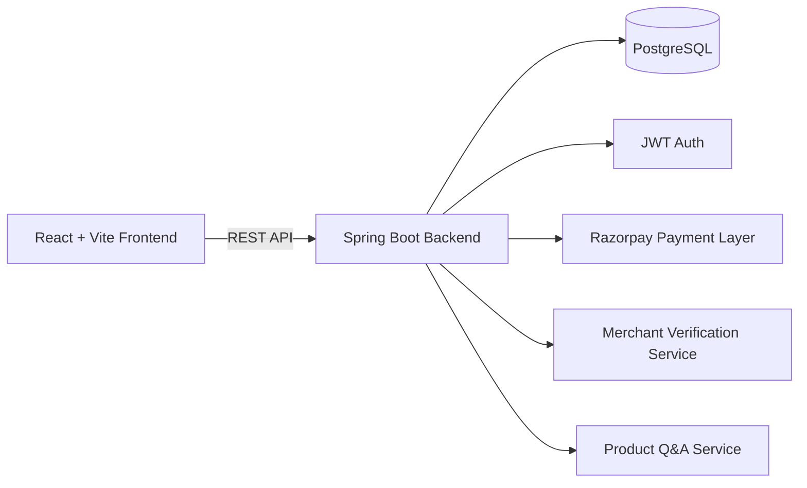

<p align="center">
  
</p>

<h1 align="center">🎓 MyCollegeMart</h1>

<p align="center">
  <strong>Your all-in-one campus commerce ecosystem.</strong>
  <br />
  Buy and sell study resources, manage merchant listings, verify sellers, ask product questions, and complete payments with a modern full-stack platform.
</p>

<p align="center">
  
  
  
  
  
  
</p>

## 📑 Table of Contents

- [🌟 What Is MyCollegeMart?](#-what-is-mycollegemart)
- [✨ Key Highlights](#-key-highlights)
- [🧱 Architecture](#-architecture)
- [📂 Monorepo Structure](#-monorepo-structure)
- [🚀 Quick Start](#-quick-start)
- [⚙️ Environment Variables](#️-environment-variables)
- [🔐 Auth and Access Model](#-auth-and-access-model)
- [🧭 API Modules](#-api-modules)
- [🌍 Deployment Notes](#-deployment-notes)
- [🛠 Scripts](#-scripts)
- [🧰 Troubleshooting](#-troubleshooting)
- [🤝 Contributing](#-contributing)

## 🌟 What Is MyCollegeMart?

MyCollegeMart is a production-style campus marketplace and service platform built as a full-stack monorepo.

It is designed for real student workflows:

- 👩‍🎓 Students discover, wishlist, and buy resources.
- 🧑‍💼 Merchants list products and manage their inventory.
- 🛡 Admins review merchant applications and approval status.
- 🧠 Buyers and sellers collaborate through product-level Community Q&A.
- 👑 A secure Master portal handles privileged operations.

## ✨ Key Highlights

### 🛒 Marketplace Experience

- Responsive product discovery with filters, search, category blocks, and polished hover interactions.
- Product detail pages with media gallery, stock visibility, specifications, and reviews.
- Wishlist and cart persistence for smoother shopping journeys.

### 💬 Community Q&A (Database-Backed)

- Ask product questions as authenticated users.
- Listing owner or admin can post answers.
- Persistent storage in PostgreSQL.
- Seller dashboard includes open Q&A counters to prioritize replies.

### 🏪 Merchant and Seller Flow

- Full listing creation and edit workflows.
- Merchant account verification lifecycle: PENDING, APPROVED, REJECTED.
- Seller dashboard with listing metrics and unanswered-question indicators.

### 🔐 Authentication and Portal Modes

- JWT-based API authentication.
- Portal selection: Individual, Merchant, Master.
- Google sign-in available for Individual and Merchant portals.
- Master portal locked to email/password login only.

### 💳 Payments and Services

- Checkout APIs for COD and online payment flows.
- Razorpay integration hooks on backend.
- Skill marketplace and assignment-help request modules.

## 🧱 Architecture



## 📂 Monorepo Structure

```text
MyCollegeMart/
|- backend/                     # Spring Boot API (Java 21)
|  |- src/main/java/...         # Controllers, services, repositories, models
|  |- src/main/resources/       # application.properties (loads schema from /database/schema.sql)
|  |- README.md
|
|- frontend/                    # React + Vite app
|  |- src/                      # Pages, components, contexts, API client
|  |- public/                   # Static assets (includes brand logo)
|  |- render.yaml               # Static deployment config
|  |- README.md
|
|- database/                    # Schema mirror used for initialization sync
|- README.md                    # Project documentation (this file)
```

## 🚀 Quick Start

### ✅ Prerequisites

- Node.js 18+
- npm 9+
- Java 21
- PostgreSQL 14+

### 1) Start Backend

Windows PowerShell:

```powershell
Set-Location .\backend
.\mvnw.cmd spring-boot:run
```

macOS or Linux:

```bash
cd backend
./mvnw spring-boot:run
```

Backend default: http://localhost:8080

### 2) Start Frontend

```powershell
Set-Location .\frontend
npm install
npm run dev
```

Frontend default: http://localhost:3000

### 3) Production Build Check

```powershell
Set-Location .\frontend
npm run build
```

```powershell
Set-Location ..\backend
.\mvnw.cmd -DskipTests compile
```

## ⚙️ Environment Variables

Primary backend config file:

- [backend/src/main/resources/application.properties](backend/src/main/resources/application.properties)

### Backend

| Variable | Purpose | Default |
|---|---|---|
| DB_URL | PostgreSQL JDBC URL | jdbc:postgresql://localhost:5432/mycollegemart |
| DB_USERNAME | Database username | postgres |
| DB_PASSWORD | Database password | 1234 |
| SERVER_PORT | Backend port | 8080 |
| CORS_ALLOWED_ORIGINS | Allowed frontend origins | http://localhost:3000 |
| JWT_SECRET | JWT signing key | dev-only-secret-key-change-me-1234567890abcd |
| JWT_EXPIRATION | JWT expiry in ms | 36000000 |
| APP_ADMIN_EMAILS | Comma-separated admin emails | empty |
| APP_MASTER_EMAIL | Master account email | master@mycollegemart.local |
| APP_MASTER_PASSWORD | Master account password | Master@1234 |
| RAZORPAY_KEY_ID | Razorpay key id | empty |
| RAZORPAY_KEY_SECRET | Razorpay secret | empty |

### Frontend

| Variable | Purpose | Example |
|---|---|---|
| VITE_API_URL | Backend API base URL | http://localhost:8080/api |

## 🔐 Auth and Access Model

### Portal Types

- 👤 Individual: shopping and service requests.
- 🏬 Merchant: product listing and seller dashboard.
- 👑 Master: privileged access with strict protections.

### Master Account Security Rules

- Master account is system-managed by backend bootstrap.
- Master account cannot be created via signup.
- Master account cannot use Google sign-in.
- Master account supports email/password login only.

Development defaults:

- Email: master@mycollegemart.local
- Password: Master@1234

Production recommendation:

- Override APP_MASTER_EMAIL and APP_MASTER_PASSWORD in your deployment environment.

## 🧭 API Modules

Main API groups:

- Authentication and profile: /api/auth/*
- Products and listings: /api/products/*
- Product Q&A: /api/products/{productId}/questions/*
- Seller dashboard: /api/seller/dashboard
- Merchant verification: /api/admin/merchants/*
- Wishlist: /api/wishlist/*
- Cart: /api/cart/*
- Checkout and orders: /api/checkout/*, /api/orders/*
- Assignment help: /api/assignment-help/*

## 🌍 Deployment Notes

- Frontend static deployment config: [frontend/render.yaml](frontend/render.yaml)
- Schema source of truth: [database/schema.sql](database/schema.sql)
- Backend loads schema from [database/schema.sql](database/schema.sql) using spring.sql.init.schema-locations
- For production hardening:
  - Set JPA_DDL_AUTO=validate
  - Use strong JWT_SECRET
  - Configure strict CORS_ALLOWED_ORIGINS

## 🛠 Scripts

### Frontend

- npm run dev
- npm run build
- npm run preview

### Backend

- .\mvnw.cmd spring-boot:run
- .\mvnw.cmd -DskipTests compile

## 🧰 Troubleshooting

### Frontend cannot reach API

- Ensure backend is running.
- Confirm VITE_API_URL is set correctly.
- Verify the URL resolves to /api endpoints.

### Master login not working

- Check APP_MASTER_EMAIL and APP_MASTER_PASSWORD values.
- Use Master portal and email/password only.
- Confirm backend startup logs do not report master bootstrap warning.

### Chunk-size warning in frontend build

- This is currently non-blocking.
- Consider route-level code splitting and manual chunking if needed.

## 🤝 Contributing

Contributions are welcome.

Suggested workflow:

1. Fork the repository.
2. Create a feature branch.
3. Commit focused changes.
4. Run frontend and backend build checks.
5. Open a pull request with clear context and screenshots for UI changes.

---

<p align="center">
  Built with ❤️ for smarter campus commerce.
</p>


